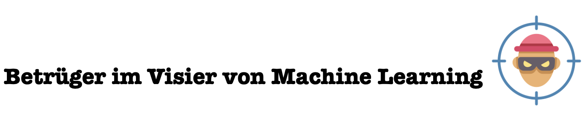
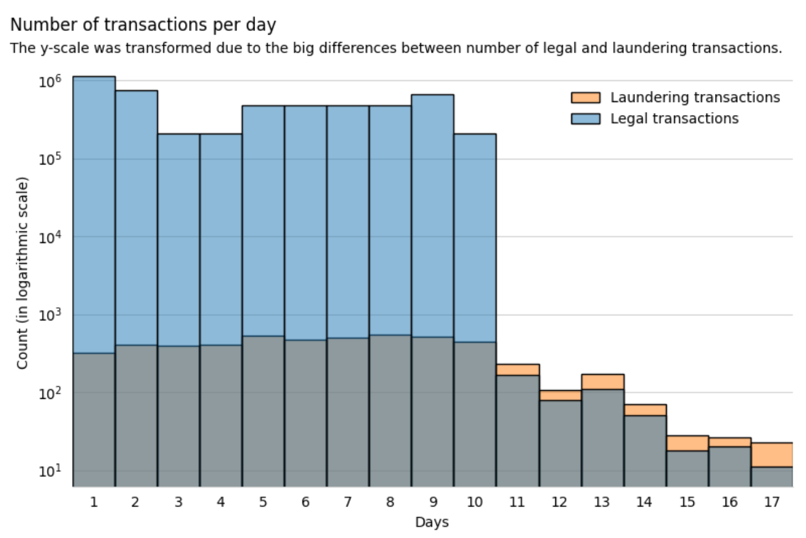
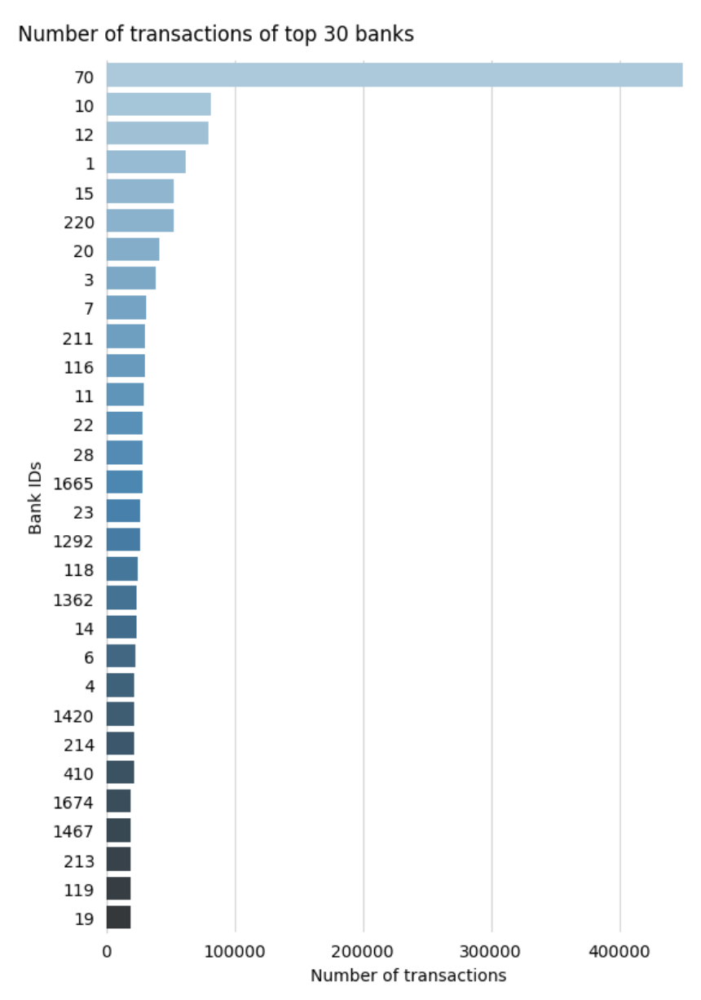
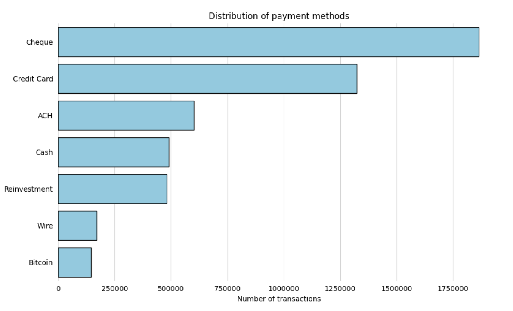

<!-- [IBM Datensatz Money Laundering](https://www.kaggle.com/datasets/ealtman2019/ibm-transactions-for-anti-money-laundering-aml). -->

<!--  -->
<!--  -->

Dieser Blogbeitrag bietet Einblicke in die Erkennung von Geldwäscheversuchen mit Machine Learning. Wir stellen verschiedene Ansätze vor und teilen unsere Erfahrungen. Der Schwerpunkt liegt darauf, die ersten Schritte von klassischen Machine-Learning-Algorithmen bis zu innovativen Graph Neural Networks zu erläutern. 

Laut den Vereinten Nationen werden jährlich 2 bis 5 % des globalen BIP – etwa 800 Milliarden bis 2 Billionen US-Dollar – durch Geldwäsche verschleiert. Ein wiederkehrendes Problem in der Geldwäsche-Forschung ist die Verfügbarkeit realer Datensätze. Das AMLworld-Framework bietet hier eine Lösung, indem es synthetische Finanztransaktionen generiert, die reale Szenarien mit hoher Präzision nachbilden, einschließlich bekannter Geldwäschemuster. Diese vollständig gelabelten Daten ermöglichen eine objektive Bewertung von Algorithmen (Altman et al., 2024). Grundlage des AMLworld-Frameworks ist der synthetische Datensatz [IBM Transactions for Anti Money Laundering (AML)](https://www.kaggle.com/datasets/ealtman2019/ibm-transactions-for-anti-money-laundering-aml), mit dem auch wir in unserem Projekt arbeiteten und den wir im nächsten Kapitel vorstellen.

## Datensatz und EDA

Der Datensatz umfasst 5.078.345 Transaktionen und 11 Variablen. Er beschreibt Transaktionen zwischen Banken und Konten, einschließlich Zeitstempeln, Beträgen, Währungen, Zahlungsformaten und Labels, die Transaktionen als legal oder Geldwäsche kennzeichnen.

Die Transaktionen erstrecken sich über 17 Tage ab dem 1. September 2022. Die meisten Daten stammen aus den ersten 10 Tagen, während die restlichen Tage weniger Aktivität zeigen. Auffällig ist das starke Ungleichgewicht: 99,9 % der Transaktionen sind legal, nur 0,1 % gelten als Geldwäsche. 

Der Datensatz umfasst 30.470 Banken und 515.080 Konten. Eine kleine Anzahl von Banken und Konten wickelt den Großteil der Transaktionen ab: Die 10 aktivsten Banken verantworten 18,1 % aller Transaktionen. Bei den Konten gibt es zentrale Akteure, von denen einige über 100.000 Transaktionen ausführen, während viele andere nur ein- oder zweimal aktiv sind.

Die Transaktionsbeträge, sowohl ein- als auch ausgehend, variieren stark. Meistens handelt es sich um kleine Beträge, doch einige extrem hohe Summen (bis zu 1 Billion USD) verzerren den Durchschnitt. Zur besseren Analyse wurden die Beträge in US-Dollar umgerechnet. 

US-Dollar und Euro dominieren die Transaktionen, während Währungen wie Bitcoin oder Saudi Riyal selten vorkommen. Interessant ist, dass 98,6 % der Transaktionen in derselben Währung erfolgen, nur 1,4 % beinhalten Währungsumrechnungen.

Der Datensatz unterscheidet sieben Zahlungsmethoden, darunter Schecks, Kreditkarten, ACH (Automated Clearing House), Bargeld und Bitcoin. Schecks dominieren, während Bitcoin, trotz seiner zunehmenden Nutzung in der Geldwäsche, selten vorkommt. 

Ein auffälliges Merkmal von Geldwäsche ist der hohe Betrag der Transaktionen, die oft am oberen Ende der Skala liegen. Während legale Transaktionen meist kleinere Summen umfassen, bewegen sich illegale häufiger in höheren Bereichen. Dies zeigt, dass große Geldbeträge in wenigen Schritten verschoben werden, um die Herkunft zu verschleiern. BILD EDA S. 24

Ein weiteres typisches Muster ist der Einsatz von Währungsumrechnungen. Geldwäscher nutzen oft verschiedene Währungen, um die Herkunft zu verschleiern und Transaktionen schwer nachvollziehbar zu machen. Dies geschieht vor allem in der sogenannten Layering-Phase, in der Geld durch ein komplexes Netzwerk geschleust wird, um die Spur zu verwischen. Obwohl Währungsumrechnungen im Datensatz nur etwa 1,4 % aller Transaktionen ausmachen, sind sie bei Geldwäsche überrepräsentiert und daher ein potenzielles Erkennungsmerkmal. BILD EDA S. 26

Auch die Aktivität einzelner Konten liefert Hinweise auf Geldwäsche. Einige Konten im Datensatz zeigen eine überdurchschnittlich hohe Anzahl an ein- und ausgehenden Transaktionen. Solche Konten könnten als "Mule Accounts" fungieren, also Zwischenstationen, über die illegale Gelder fließen. Die Analyse zeigt, dass diese Konten oft zentrale Knotenpunkte in Transaktionsnetzwerken bilden und deshalb besonders auffallen. BILD EDA S. 28.

Im Kampf gegen Geldwäsche ist es auch entscheidend, typische Muster in Transaktionen zu erkennen, die illegale Aktivitäten verraten. Solche Muster beschreiben spezifische Verhaltensweisen, die darauf abzielen, die Herkunft illegaler Gelder zu verschleiern und sie als legitim erscheinen zu lassen. Im Datensatz sind diese Muster häufig gekennzeichnet, sodass die meisten Transaktion einem bestimmten Muster zugeordnet werden können. Diese Kennzeichnung basiert auf bekannten Geldwäschemechanismen und umfasst Simple Cycles, Scatter-Gather-Strukturen, Chains und andere komplexe Netzwerke. Nachfolgend stellen wir zwei der prominentesten Geldwäsche-Muster aus dem Datensatz vor: Simple Cycles und Scatter-Gather-Strukturen. 

### Simple Cycles
Das Simple Cycles-Muster beschreibt eine geschlossene Kette von Transaktionen, bei der Gelder innerhalb eines festen Kontenkreises zirkulieren. Diese Strategie zielt darauf ab, die ursprüngliche Herkunft der Gelder durch mehrfache Überweisungen zu verschleiern. 

Beispiel:
- Konto A überweist Geld an Konto B. 
- Konto B überweist einen Teil oder den gesamten Betrag an Konto C. 
- Konto C überweist schließlich das Geld zurück an Konto A. 
BILD AUS PAPER

Dieses Verhalten zeigt sich oft in der Layering-Phase der Geldwäsche, wenn man Gelder durch verschiedene Konten schleust, um die Spur zu verwischen. Simple Cycles wirken zunächst legitim, doch ihre wiederholte Struktur und der fehlende wirtschaftliche Zweck entlarven sie. In den zuvor vorgestellten Modellen gelten sie als besonders schwer erkennbar, vor allem bei mehr als sechs beteiligten Konten.

### Scatter-Gather-Strukturen
Ein weiteres verbreitetes Muster ist die Scatter-Gather-Struktur, die oft in der Integrationsphase der Geldwäsche verwendet wird. Dieses Verhalten besteht aus zwei klar unterscheidbaren Teilen: 

Scatter: Gelder werden von einem zentralen Konto auf mehrere Empfängerkonten verteilt. 

Gather: Die Gelder fließen anschließend von diesen Empfängerkonten zurück auf ein oder mehrere zentrale Konten. 

Beispiel:
* Konto A überweist Gelder an die Konten B, C und D (Scatter). 
* Konten B, C und D leiten diese Gelder zurück an Konto E (Gather). 
BILD AUS PAPER

Diese Struktur verschleiert die Geldspur durch Streuung und spätere Zusammenführung. Scatter-Gather-Muster sind oft hochgradig organisiert und schwer zu erkennen, da ähnliche Verhaltensweisen auch in legitimen Transaktionsnetzen vorkommen können. 

